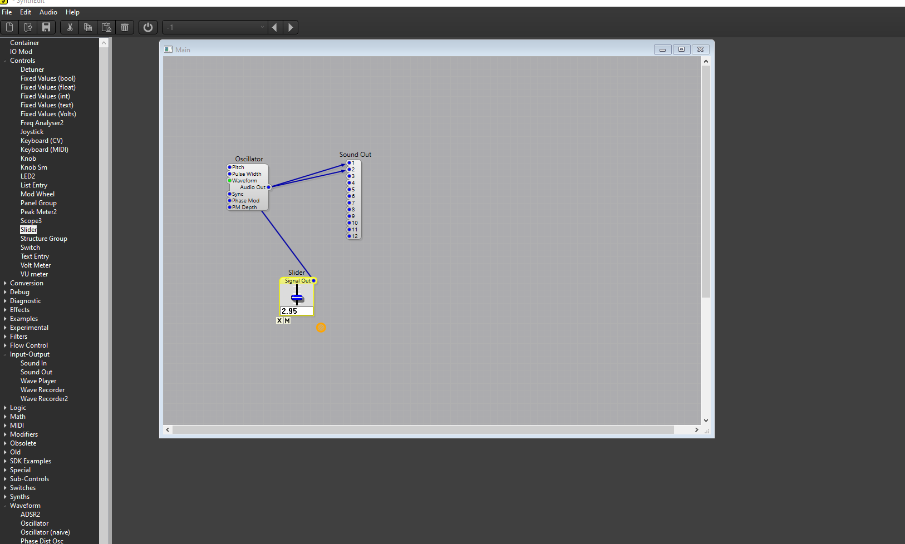
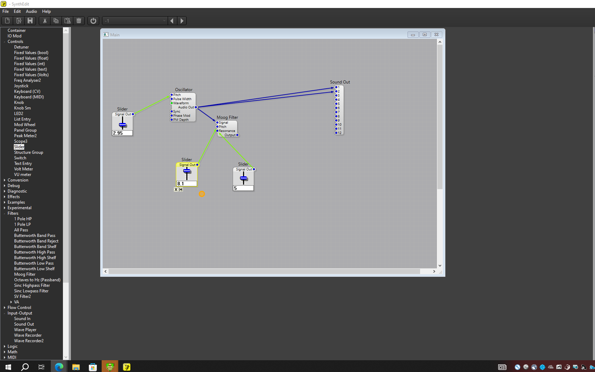
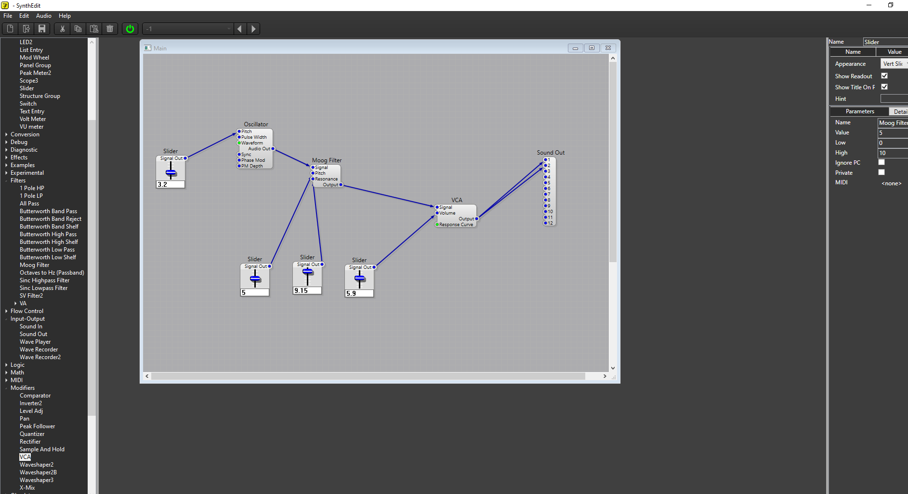
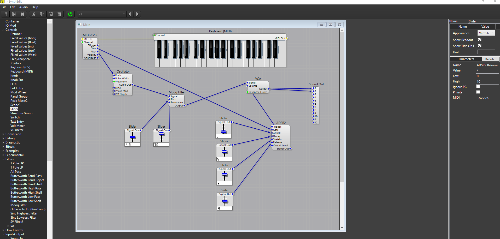
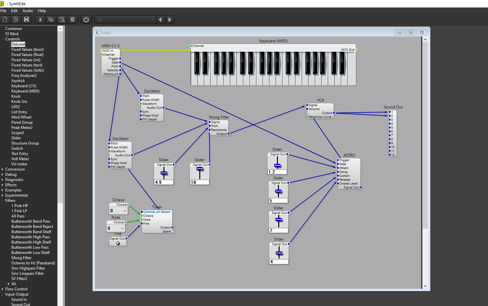
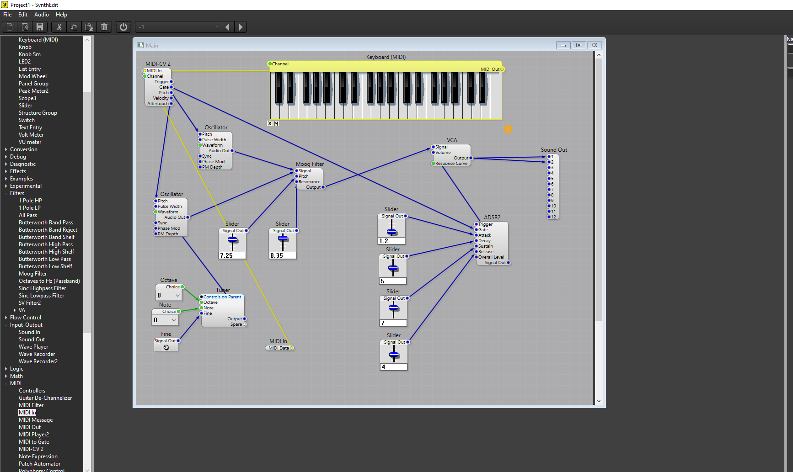
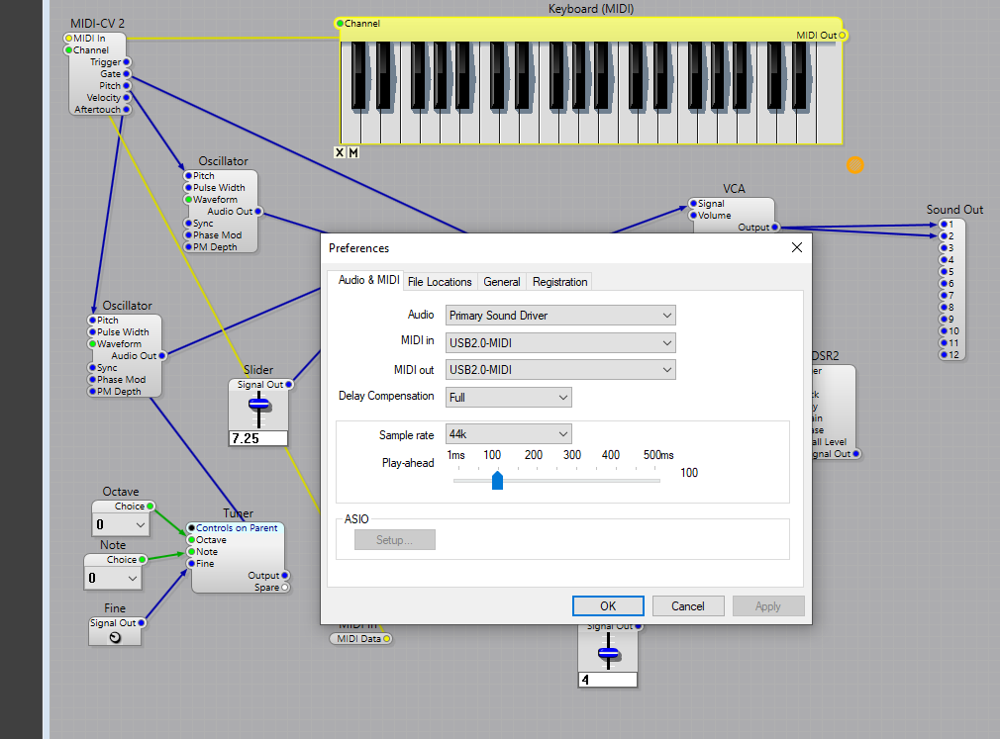

## Table of contents

> The journey of electronic music traces back to its roots in physics laboratories, where early compositions were created for experimental instruments such as signal generators, noise generators, and ring modulators. This section provides an overview of the transition from early tape recordings to contemporary digital recording methods.

## 1. Historical Development

**The Theremin**

An exploration of the Theremin, an early electronic instrument that utilized audible beat frequencies of radio frequency oscillators. The article discusses its unique playability, with musicians producing sounds without physical contact.

## 3. Innovations in Sound Synthesis

**3.1 Bode, Buchla, Moog, and Serge**

The concurrent development of modular synthesizers by Bode, Buchla, Moog, and Serge marked a transformative period in electronic music. This section explores the impact of modular synthesizers and sequencers on sound creation, providing examples of iconic tracks like "I Feel Love" by Donna Summer.

**3.2 String Machines**

Simple electronic organs, known as string machines, are discussed for their ability to produce approximations of string, brass, and organ sounds.
I try to elaborate on the significance of these instruments in shaping the sonic palette of various genres.

**3.3 Small Synths: Synthi and Minimoog**

Exploration of the Synthi, the first British synth, and the Minimoog, the most popular synth that set the standard for modern synthesizers and their unique features and contributions to electronic music.

## 4. Digital Revolution

**4.1 FM Synthesis and MIDI**

The advent of FM synthesis, pioneered by John Channing, is detailed, highlighting its role in creating new sounds and its impact on older synthesizers. The introduction of MIDI _**(Musical Instrument Digital Interface)**_ revolutionized communication between synthesizers, streamlining the music production process.

**4.2 Sampling and Computer Music**

The Mellotron's use of tape loops and the Akai 1000's digital sampling capabilities are discussed, emphasizing their influence on music production. The article **[3]** then delves into the democratization of music-making through software like Fruity Loops and Garageband, enabling musicians to create music on laptops.

## 5. The Resurgence of Analogue Synths

**5.1 Modern Modular Synthesizers**

The resurgence of analogue synths is explored, emphasizing the desire for a tactile and hands-on approach in contrast to digital perfection. A look at modern modular synthesizers showcases their popularity and unique capabilities.

**5.2 Building a Simple Synth**

The article includes a section that walks through the components of a simple synthesizer, emphasizing the relevance of analogue models in contemporary digital synths. It also touches upon the reasons behind the enduring popularity of analogue interfaces.

## 6. Fundamental Properties of Sound

**6.1 Pitch, Timbre, and Loudness**

There are three fundamental properties of sound – pitch, timbre, and loudness – explaining their significance in shaping the auditory experience, the basic analogue model of synthesis and its main components: oscillator/noise, filter, amplifier, envelope generator, modulators, and mixers.

## 7. Synthesis Models

**7.1 The Basic Analogue Model**

A detailed exploration of the basic analogue model of synthesis, explaining how oscillators, filters, amplifiers, envelope generators, modulators, and mixers work together to shape the sound.

## 8. In the Lab: Creating a Synthesizer

This section I tried to build a simple synthesizer in a lab setting.
It covers customization options and explores the messages used to control a synthesizer.

**This is examples using the software called SynthEdit:**

1. Osclliator:



---

1. Moog + Oscukkator



---

3. Moog + Oscukkator + VCA



---

4. Keyboard MIDI



---

5. Second Oscukkator



---

**Here we Use Arduino to work with SynthEdit:**

Here We need to connect Our Arduino Kit to the connector (Cable) that will send the signals to the Software (SynthEdit):



<br />
<br />

## By using this _**Connector**_ (MIDI Connector):



## Then we need to upload this Code used to run Arduino and implement MIDI notes:

```c
void setup() {
  // Set MIDI baud rate:
  Serial.begin(31250);
}

void loop() {
  // play notes from F#-0 (0x1E) to F#-5 (0x5A):
  for (int note = 0x1E; note < 0x5A; note ++) {
    //Note on channel 1 (0x90), some note value (note), middle velocity (0x45):
    noteOn(0x90, note, 0x45);
    delay(100);
    //Note on channel 1 (0x90), some note value (note), silent velocity (0x00):
    noteOn(0x90, note, 0x00);
    delay(100);
  }
}

// plays a MIDI note. Doesn't check to see that cmd is greater than 127, or that
// data values are less than 127:
void noteOn(int cmd, int pitch, int velocity) {
  Serial.write(cmd);
  Serial.write(pitch);
  Serial.write(velocity);
}
```

## 9. Conclusion

In conclusion, the journey of electronic music is a fascinating exploration of innovation and evolution. From the early days of the Theremin, which allowed musicians to create sounds without physical contact, to the transformative period marked by the development of modular synthesizers by pioneers like Bode, Buchla, Moog, and Serge, the landscape of electronic music has continually expanded.

The digital revolution brought about significant changes, with the advent of FM synthesis, MIDI communication, and the introduction of sampling and computer music. These technological advancements not only created new sonic possibilities but also revolutionized the music production process, democratizing music-making through software like Fruity Loops and Garageband.

<br />
<br />
<br />

---

## References:

1. The Digital Musician (3rd Edition). [Online] Available at [ https://www.andrewhugill.com/thedigitalmusician/magee.html ] (Accessed: [2018]).

2. Sample Of Electronic Music History. [Online] Available at [ https://artsandculture.google.com/story/a-sample-of-electronic-music-history/dAXxiIiMWfSD4A?hl=en ].

3. A Case Study Exploring the Use of Garageband™ and an Electronic Bulletin Board in Preservice Music Education. by Vetta Vratulis, Saginaw Valley State University; & Charlene Morton, University of British Columbia [Online] Available at [ https://citejournal.org/volume-11/issue-4-11/general/a-case-study-exploring-the-use-of-garageband-and-an-electronic-bulletin-board-in-preservice-music-education/ ] (Accessed: [issue-4-11]).
