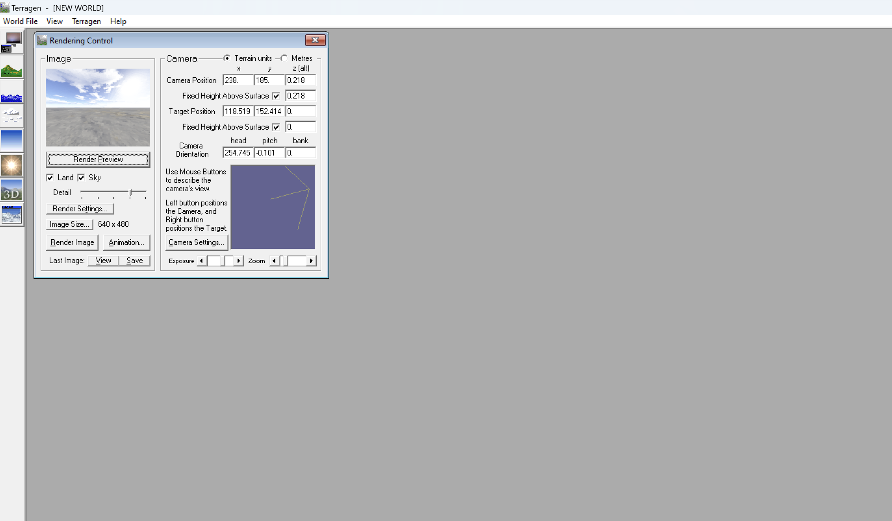
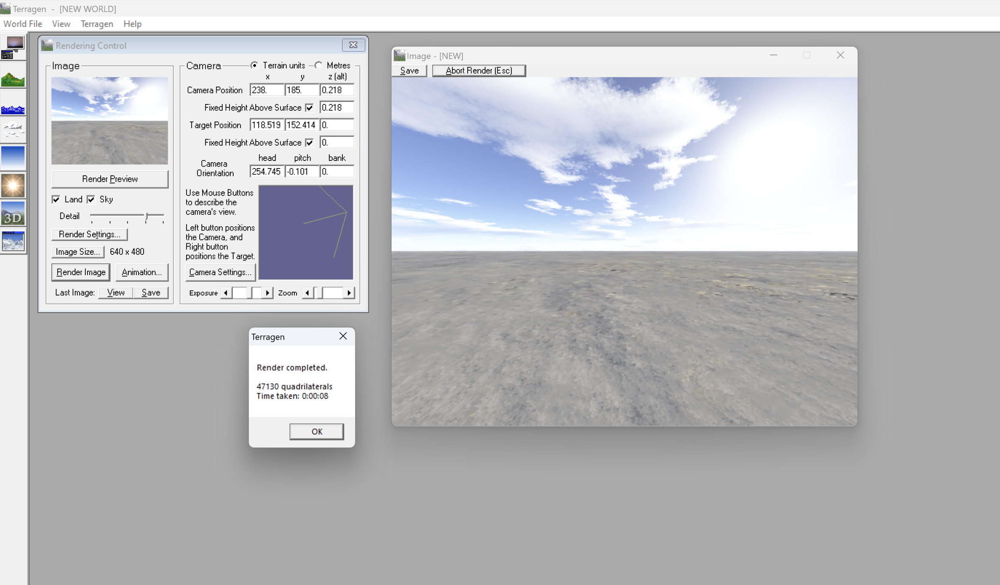
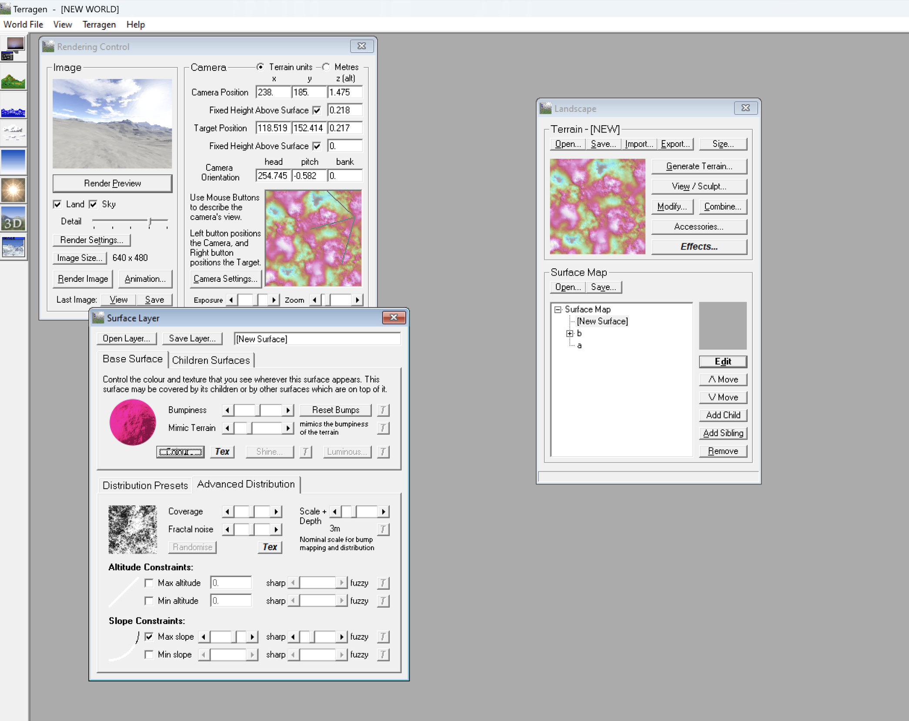
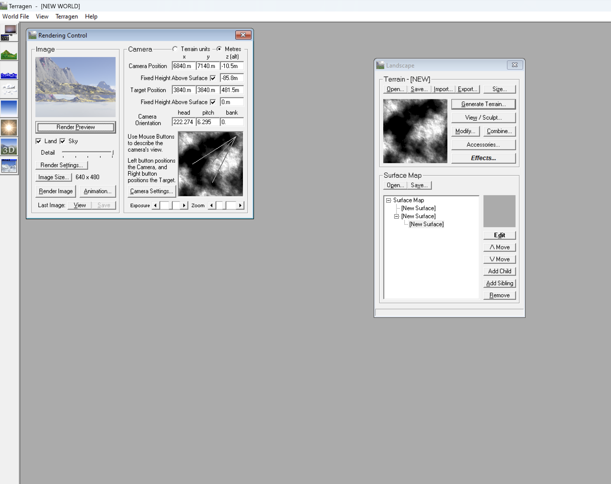
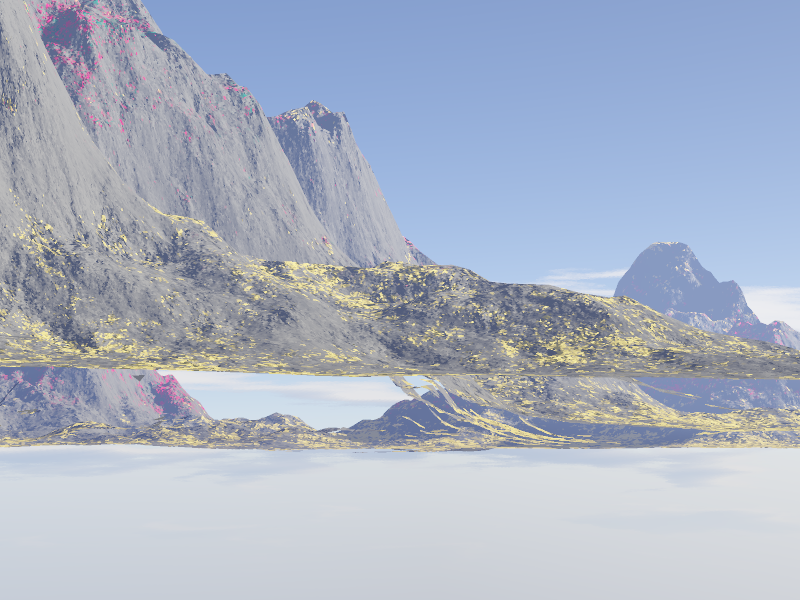

## Table of contents

The objective is to create a diverse portfolio of synthesized landscapes, ranging from photorealistic to otherworldly vistas. In this article, we delve into our experiences with Terragen and the significance of image synthesis in the digital landscape.

## Unveiling the Wonders of Terragen

Our journey began with a fundamental understanding of Terragen's core concepts. The software works in a 3D environment, allowing us to manipulate landscapes from different angles and perspectives. It starts with the observer's position, which serves as the anchor for all calculations, transforming the world into an artistic canvas. Matrices enable us to represent object positions in 3D space, facilitating transformations like rotation and scaling.

## Some of the Images Generated by Terragen:

## Perlin Noise Image

---

## Render Preview

---

## Adding a Child Layer

---

## A rendered Image with the Child Layer

---

## I can generate a different image from creating "Child Layers", it allows me to add an interesting variant to the pre-rendered image, I can modify a lot of settings which nice, such as the distribution of the coverage and bumpiness, for example:

---

## It would also add more life to the rendered image if I can modify the colours of the layer, so it would be unique and has a more interesting view, for example:

---

## I also aimed to change the condition of lighting, as you can see here I can modify the colour of the sun, direction, and sunlight strength, After some trial and error, I made these adjustments and modified the colour of the sun, direction, and sunlight strength, for example:

---

## Water Level

---

## At the end we can render these beautiful mountains, generating the feel of grass, the green land and the sun shining towards the hills is magnificent and I liked it:

## The Result after adding the Water Level to the Rendered Image is amazing, it adds a lot of life to the image, and it looks more realistic, for example:

---

## The Enigma of Perlin Noise and Fractals

Terragen's ability to generate inspiring landscapes is underpinned by the enigmatic Perlin noise. This algorithm employs interpolated gradient vectors to produce pseudo-random variations in space and time, resembling natural phenomena. Originally invented by Ken Perlin for generating textures in the film "Tron," it has since won accolades, including a special Academy Award in 1997.

## The Significance of Image Synthesis

As our world becomes increasingly digital, the ability to synthesize images that range from the hyper-realistic to the surreal and otherworldly becomes more crucial than ever. With precise and efficient models, we can replicate complex natural phenomena, making image synthesis an integral part of modern digital media engineering.

In conclusion, Terragen stands as a remarkable testament to the power of image synthesis in the hands of skilled creators. The journey through this tool has been an eye-opening experience, demonstrating that the boundaries of creativity and technology are ever-expanding. As we continue to explore this captivating field, we look forward to the infinite possibilities that image synthesis holds, and how it will shape our digital landscape in the years to come.

**References:**

1. Perlin noise. [Online] Available at [https://en.wikipedia.org/wiki/Perlin_noise#:~:text=Perlin%20noise%20is%20a%20type,the%20creation%20of%20image%20textures] (Accessed: [Sep.2023]).

2. Image Synthesis. [Online] Available at [https://www.sciencedirect.com/topics/computer-science/image-synthesis] (Accessed: [2020]).

3. Terragen Classic Basics for Windows [Online] Available at [https://www.naturescapes.net/articles/techniques/terragen-classic-basics-for-windows/] (Accessed: [Mar.2010]).
