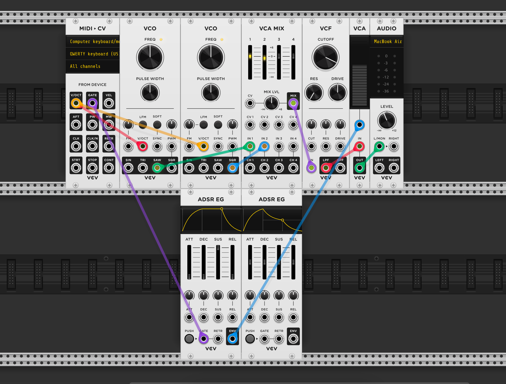
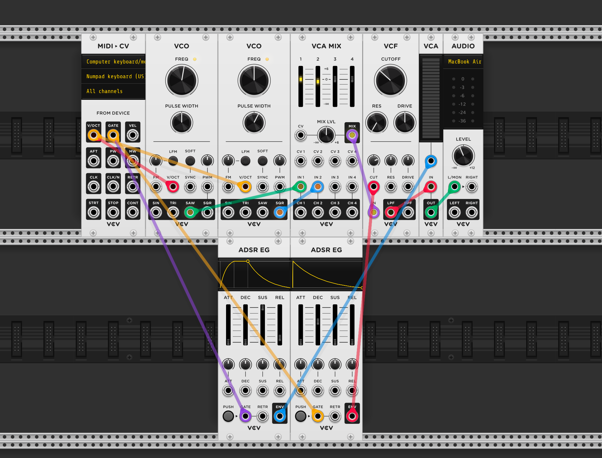

## Table of contents

## Introduction:

VCV Rack is like a super cool playground for music lovers. It's this amazing virtual modular synthesizer that basically unlocks a ton of creative doors for you. Whether you're a pro in the music game or just stepping into the electronic music universe, VCV Rack has got your back. It gives you this awesome and easy-to-use platform to play around with modular synthesis and unleash your musical creativity! 🎹 🎶

## Understanding Modular Synthesis:

imagine modular **synthesis** like building your own musical universe. You connect various modules, like building blocks, to create unique sounds. These modules are like musical gadgets – there are oscillators for generating tones 🎵, filters to tweak the sound, and sequencers to control the rhythm. Now, VCV Rack takes this whole creative process into the digital world, letting you craft your own virtual modular setups and dive into the world of electronic soundscapes! 🎶✨

## Examples:

- **I initially crafted a simple rack comprising the following elements:**
  This formed the foundational arrangement of my rack, producing a sound reminiscent of my previous rack creation. Here's how the fundamental template of my rack sounds: MIDI CV, Mixer Audio.

1. MIDI CV
2. AUDIO

  

---

Having established this fundamental sound, my subsequent idea is to craft a distinct sequence of sounds to facilitate the creation of an overlaying sequence.

**I Added the following to my rack:**

1.  Two oscillators
2.  With those oscillators I got a Mixer
3.  I also brougth a filter
4.  a Voltage Control Amplifer

And I patched them together to give me this type of Rack

 

And it sounded like this :

<video width="850" height="440" style="width: 400px" controls>
  <source src="1.mov" type="video/mov">
  Your browser does not support this video.
</video>

 

I can control the pitch with my MIDI controller. However, I'm facing a challenge in controlling the start and stop times of the notes. To address this issue, I needed to introduce an envelope to modulate the amplifier. I brought a ADSR envelope and I'll bring in another one. Now, I can establish the connection by linking our first envelope to the control input of the setup.

But as I increase the amplifier, I noticed that the levels darken because the envelope is now in control. To reset the envelope to a favorable starting position, a manual adjustment can be made. By pressing the push button, the envelope can be triggered manually. However, a more common approach involves utilizing the gate signal from our MIDI device:

# 

When I press the key it triggers the attack decay and sustain stage and when and when I release the key it triggers the release stage and it sounds like this :

<video width="550" height="340" style="width: 400px" controls>
  <source src="https://cdn.sanity.io/files/nnrx9w3l/production/3bae2b97b7cfcae82881299cc72ee45c3b6b608e.mp4" type="video/mp4">
   Your browser does not support this video.
</video>

---

**Finally I wanted to tweak things a bit try something different, I Added the these to my rack:**

To enhance expression, I can use a second envelope to govern the cutoff frequency of our filters. Adjusting the cutoff frequency by backing it off, and establish a connection from the second envelope's output to the control input of the filter's cutoff frequency. Triggering this envelope will be synchronized with the gate signal from our MIDI device. Resetting the envelope to a standard modulation starting point, I'll repeatedly play a note while gradually increasing the modulation depth control until achieving the desired effect. If the modulation decay is too swift, I can fine-tune it by slowing down the decay.

Then I got this result:

# 

And It sounds like this:

 

<video width="550" height="340" style="width: 400px" controls>
  <source src="https://cdn.sanity.io/files/nnrx9w3l/production/983db3de86cb2bb4ed67f37dc7cdbc6ac9b9d790.mp4" type="video/mp4">
   Your browser does not support this video.
</video>

  

## Conclusion:

As a beginner trying out things and the possibilities of VCV Rack, I find this software to be exceptionally beautiful and a powerful and user-friendly tool. It serves as a fantastic platform for exploration, allowing me to play around with various options and learn about synthesizers and the art of making music with software. VCV Rack, in the world of virtual modular synthesis, stands out as a powerful and user-friendly tool. Whether one is a music producer, sound designer, or someone merely curious about electronic music, VCV Rack offers an accessible entry point into the captivating world of modular synthesis. This virtual playground of sound invites users to dive in, explore, and let their creativity flow, mirroring the experience of working with a real synthesizer.
