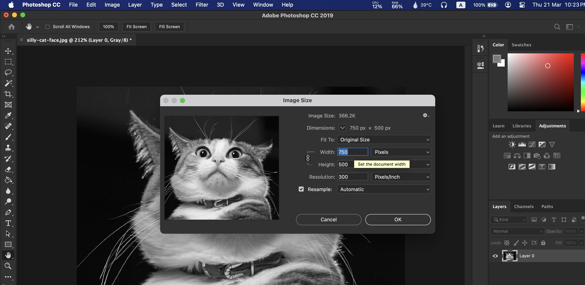
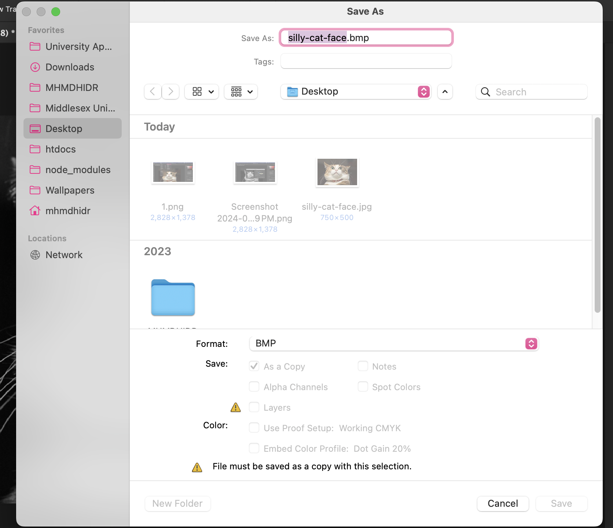
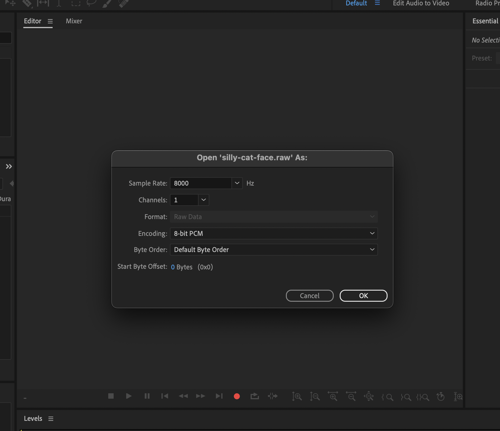
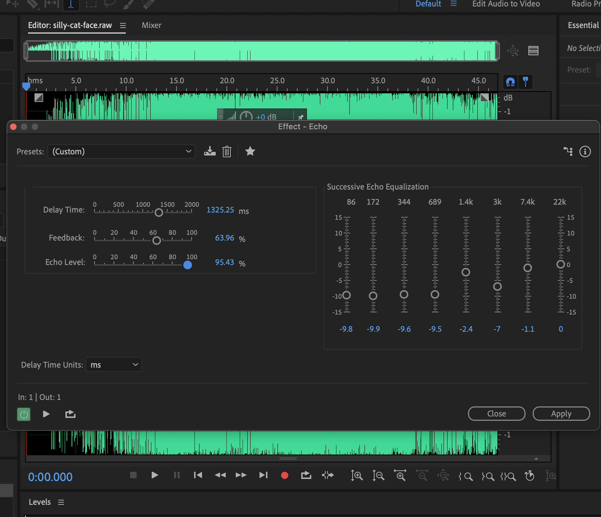
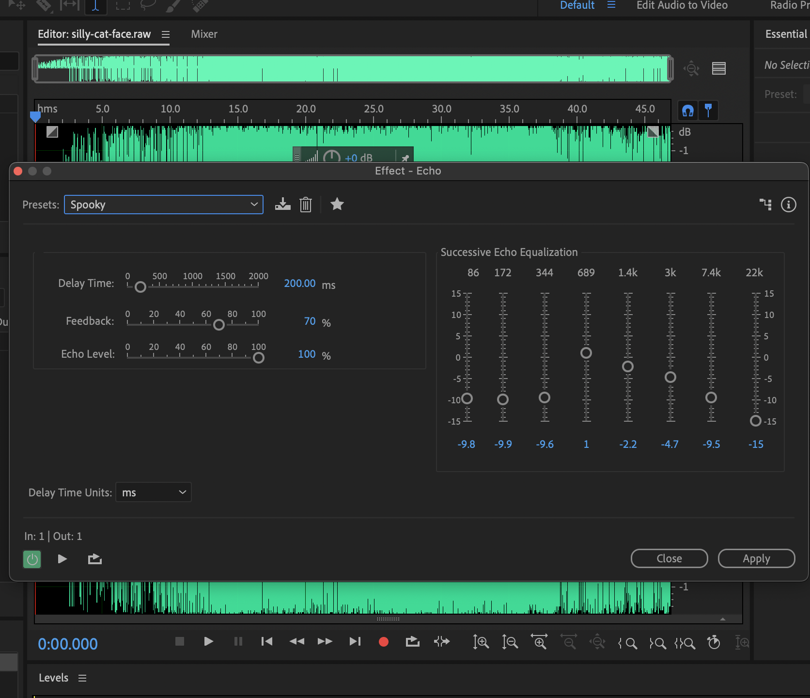

## Table of contents

## Introduction

In the world of media, combining sounds and images has gone beyond the usual. It's opened new doors for creativity and learning. Our journey to understand media data and try new things has been a real eye-opener. We've not only figured out the technical stuff but also how different types of media are connected. So, let's jump into the world of playing with data and see how images and sounds mix.

## Intro to Sound and Image Editors

To start on this journey, we looked into the world of sound and image editors. For manipulating images, we harnessed the creative power of Photoshop. This versatile tool not only allows for creative image enhancements but also offers the ability to make corrective modifications with precision.

In the realm of audio, we relied on Audition which provided us with the means to work creatively and correctively on audio files. The scope ranged from comprehensive sound alterations to fine-tuning tiny segments of sound. These editors served as our palette, enabling us to paint with both pixels and waveforms, pushing the boundaries of creative expression.

## Understanding Digital Image and Sound

Before diving into our experiments, we needed a basic understanding of digital images and sounds. Digital images consist of tiny points called pixels, each with a brightness value. For colored images, we typically have three values, representing the Red, Green, and Blue components, each using eight bits, totaling 24 bits. In grayscale images, we have just one value, generally represented by 8 bits.

Sound is our perception of rapidly changing air pressure. This auditory information is converted into electrical energy and sampled at high speeds, often 44,000 times per second (44 kHz) for high-quality audio, using 8, 16, or 24 bits for each sample. These measurements serve as the foundation for recreating the sounds we hear.

## File Structure: The Foundation of Data

The structure of data files plays a crucial role in our experimentation. Files are not just collections of samples; they also hold information on how these samples should be displayed or played. In some cases, sample data is compressed using mathematical techniques, and this information is stored in the file header.

## Stripping the Header and Working with Raw Data

To experiment with data, we explored working with raw data, and eliminating the file header. However, when dealing with images, we needed to provide essential information like height, width, and the number of colors (sample size). For audio, specifying the sample size and sampling rate was vital.

Our task "An Image With Echo!" exemplified this concept. We began with a bitmap image, converted it to grayscale, and recorded its dimensions. After saving it as "image.raw" without a file header, we ventured into Audition to open the "image.raw" file as unsigned 8-bit data. By adding an echo effect, we explored the fascinating overlap between visual and auditory media. Revisiting the file in Photoshop, with the height and width specified as recorded, we observed the visual representation of the echo.

---

1. First, we take out the image and change its mood to Grayscale

---

2. Record the height and width of the image using a notepad or a paper

---

3. Then save it as a bitmap image (.bmp)

---

1. Save the image also as a raw file (image.raw) with no file header.

---

5. Open Audition and open the (image.raw) file as unsigned 8 bit data (the sampling rate can be left as the default).

---

---

1. Use the transform menu to add an echo.

---

8. Save the file as image-echo.raw and we’ll ignore any warnings.

---

9. Open the file in Photoshop program as 8-bit greyscale and put the height and width that we recorded in when requested.

---

10. Can we see the echo?

### Here are some other examples I have experimented with:

---

## Reversing the Process

Interestingly, we also explored the reverse process, investigating how sound could be manipulated in an image editor. We delved into what happens when sound is blurred or sharpened and how a simple image translates into a sound waveform. This exploration shed light on the fundamental operations of media editors.

## Conclusion

Our journey to understand media data, the interplay between sound and images, and the hidden facets of files has been a path of discovery. By stepping into the world of media editors and embracing experimentation, we've uncovered the power of data and the profound connections between different forms of media. Our experiments and discussions have illuminated the rich possibilities of data manipulation.

**References**

1. The noise of art: Pixelsynth can turn your images into music for free
   [Online] Available at: [https://www.musicradar.com/news/tech/the-noise-of-art-pixelsynth-can-turn-your-images-into-music-for-free-638423] (Date: [May.2016]).

2. Make glitch art by data bending an image as audio using Adobe Audition - A Simple Guide. [Online] Available at: [https://hani-amir.com/blog/2016/3/13/make-glitch-art-by-data-bending-an-image-as-audio-using-adobe-audition] (Date: [Mar.2016]).
