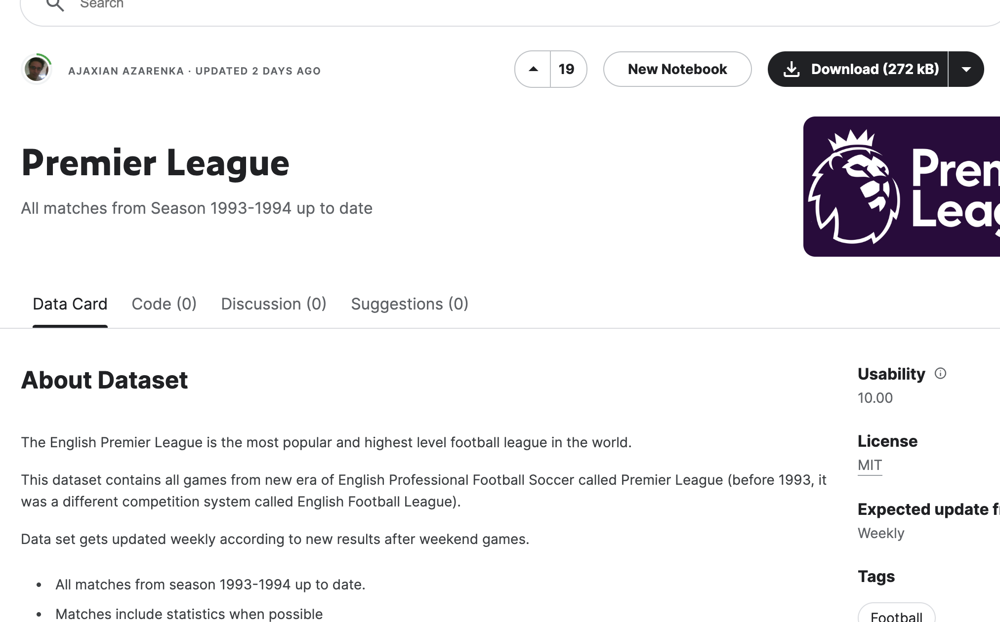
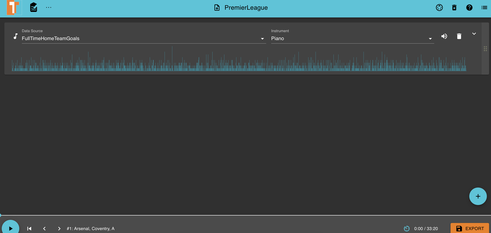
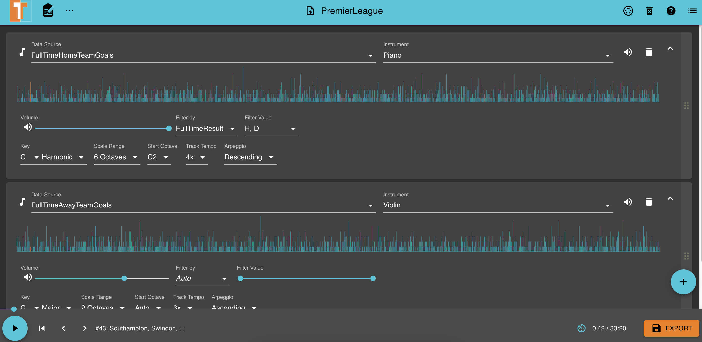
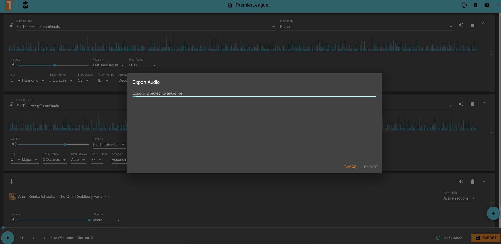

## Table of contents

## Making Data into Sound: Sonification

Sonification is like turning data into music for your ears. Instead of seeing numbers and graphs, you can hear them as sounds. With sonification, you can use your ears to understand information instead of just looking at it.

## Why Use Sonification?

Our ears are good at noticing changes in sounds, like going from high to low notes or getting louder or quieter. Sonification helps us use this skill to make data more interesting and easier to understand [1].

## Analog vs. Digital Sound

You can make data into sound using older technology or newer digital methods. It's kind of like playing a record or using a music app. Both can work, but with digital, you have more control [1].

## Twotone Sonification Tool:

- The Twotone sonification tool is an online tool developed by Datavized [2] Technologies and supported by Google News Initiative.
- It allows users to sonify data provided by Twotone or load their own data in various formats (xls, xlxl, csv, ods files with up to 2000 rows).
- By default, the software maps the data to a 2-octave range, where higher values correspond to higher pitch, using a preset piano. Each note has the same duration.
- Also we can adjust parameters such as range (1-3 octaves), scale, instrument, note duration, and tempo.
- This tool for sonification provides the option to filter data so that only a certain range is sonified.
- Users can add an audiotrack to complement sonification, and the entire sonification can be exported as an audio file.

## Sonic Pi Code for Data Sonification:

- The provided code demonstrates how to load data into music using Sonic Pi, a live-coding environment.
- The code iterates through the data, assigning values to variables (e.g., topic1 and topic2) and uses a piano synth to play these values.
- The code includes parameters such as attack, decay, and amplitude, adding a random element to create dynamic variations.
- The code lacks explicit pitch mapping, and suggestions are made to normalize data or use external tools like Musicalgorithms for pitch mapping.
- The live-coding aspect allows real-time changes to the code, providing flexibility in adjusting the musical output.
- Additional code snippets are provided for introducing beats, loops, samples, and other elements in Sonic Pi [2].

## Exmaple:

---

<br />

##### Define a sample dataset (you can replace this with your actual data)

```ruby
data = [
  { topic1: 0.75, topic2: 0.45 },
  { topic1: 0.60, topic2: 0.30 },
  { topic1: 0.85, topic2: 0.55 }
]
```

##### Iterate through the data and play notes using Sonic Pi

```ruby
live_loop :music_loop do
  data.each do |line|
    topic1 = line[:topic1].to_f
    topic2 = line[:topic2].to_f

    # Use a piano synth to play notes based on data values
    use_synth :piano

    # Play notes with dynamic variations (randomized attack, decay, and amplitude)
    play topic1 * 100, attack: rand(0.5), decay: rand(1), amp: rand(0.25)
    play topic2 * 100, attack: rand(0.5), decay: rand(1), amp: rand(0.25)

    # Introduce a short delay between notes
    sleep 0.5
  end
end
```

##### Additional code snippet: Introduce beats and loops

```ruby
live_loop :drums do
  sample :drum_bass_hard
  sleep 1
end
```

##### Additional code snippet: Introductory ta-da

```ruby
live_loop :intro do
  sleep 2
  sample :ambi_choir, attack: 2, sustain: 4, rate: 0.25, release: 1
  sleep 6
end
```

##### Additional code snippet: Ominous drum sound throughout the music

```ruby
live_loop :ominous_drum do
  with_fx :reverb, room: 0.5 do
    sample :bd_boom, rate: 1, amp: 1
  end
  sleep 2
end
```

---

<br />

**Examples of Sonification**

People use sonification in different ways:

1. **Helping the Blind:** Sound can be used to help blind people navigate by telling them about their surroundings.

2. **Radiation Check:** Geiger counters make clicking sounds to tell you about radiation levels.

3. **Stock Market:** You can turn stock market data into music to understand how it's changing.

4. **Heart Monitors:** The beeping sound in a heart monitor tells you about your heart rate.

**Filters and Data**

Think of filters as special ears for sound. They only let some sounds through. This can help you hear the important stuff and not the extra noise. It's like adjusting the bass and treble on your music.

When working with data, you need to think about whether the data is slow-changing or fast-changing, just like watching a slow movie versus a fast one. You also need to deal with unwanted noise, like static on a radio.

**Challenges and Difficulties**

Using sonification is a bit tricky. I have to know when it really helps and when it's just for fun. Sometimes, the tools you need might not be available. And, it's not just science; it's also an art. Sometimes, you have to create your own rules and methods.

Using a two-tone tool online we can convert a dataset and make sonification on it.

1. **Download a data set from Kaggle (a small data set)**



<br />

2. **Upload it to the two-tone tool online to make sonification on it:**



<br />

3. **After Further Manipulation of the sound we can generate something different:**


<br />

4. **We can also click on narration audio to give us a different variation of the audio and we just adjust it to have a more interesting result:**


<br />

5. **Export the sound as MP3 format:**

we can export the generated sound into mp3 and hear it:



<br />

This is the output sound after using **"two-tone"**:

<audio controls style="width: 100%">
  <source src="/blogs/sonification-turning-data-into-sound/premierleague.mp3" type="audio/mpeg">
  Your browser does not support the audio element.
</audio>

<br />

---

##### Conclusion:

sonification is like turning boring data into music or sound, making it more interesting and helping you understand things using your ears. It's a bit like magic for your ears!

---

##### **Refereces**

1. twotone (n.d.) _SONIFICATION ART A blog on sonification in an artistic context_. [Online] Available at: https://sonificationart.wordpress.com/2019/03/14/twotone-an-easy-introduction-to-sonification/ (Accessed: [Mar.2019]).

2. Programming Historian (n.d.) \*The Sound of Data (a gentle introduction to sonification for historians). [Online] Available at: https://programminghistorian.org/en/lessons/sonification (Accessed: [June.2016]).

3. Sonification and the Hybridization of
   Aesthetic Experience. Performance Research: a journal of the performing arts, 25 (4). pp.
   45-53. ISSN 1352-8165 . [Online] Available at: https://eprints.whiterose.ac.uk/170300/3/Kapsali%20Sonic%20Bodies%20FINAL.pdf (Accessed: [June.2016]).
